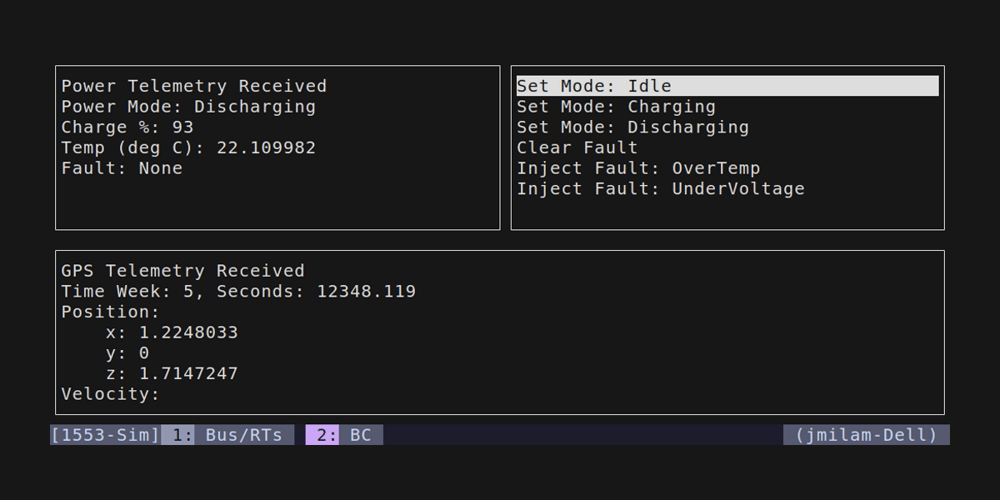
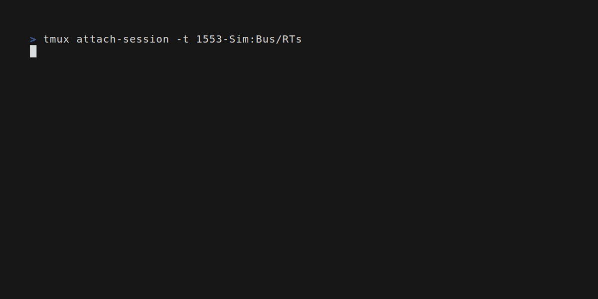

# Rust 1553 Simulator

[](https://opensource.org/licenses/Apache-2.0)

A Rust MIL-STD-1553 simulator featuring a bus controller, simulated remote
terminals, and a terminal user interface. The project demonstrates protocol
design, asynchronous networking, layered architecture, and terminal user
interface development.




# Overview
MIL-STD-1553 is a serial data bus standard used throughout military and
aerospace avionics to connect a central bus controller (BC) to multiple
remote terminals (RTs) — sensors, actuators, and subsystems — over a
shared, dual-redundant bus. Communication follows a strict command/response
model: the BC issues a command word, the addressed RT replies with a status
word and, depending on the command, data words.

Real 1553 hardware runs over shielded twisted-pair cable with its own
electrical and encoding layer which makes it impractical to develop or test
application logic against without physical interface cards. This project
simulates the logical layer of 1553 — the word formats and command/response
transaction model — over TCP.

# Architecture
The project separates protocol, transport, scheduling, and application concerns
so each layer can evolve independently. For example, the transport layer can be
replaced without modifying the protocol implementation.

- `protocol`: MIL-STD-1553 word/message types — encode/decode only, no I/O
- `net`: TCP transport for exchanging protocol messages between processes
- `runtime`: Scheduling primitives used to drive periodic/async work
- `devices`: Simulated remote terminals (GPS, Power), built on `protocol` and
  `net`
- `app` / `app/tui`: Bus controller orchestration and the terminal UI
- `bin`: Thin executables that launch each process (bus, RTs, bus controller)

Dependency direction flows outward from `protocol`: `net` and `runtime`
each depend only on `protocol`; `devices` and `app` build on all three; `bin`
wires the finished pieces into runnable processes.

# Features
- Bus Controller
    - Supports both scheduled commands and manually issued commands through the
      terminal user interface.
- GPS
    - Simulates a moving GPS receiver with continuously updating position and
      GPS time.
- Power
    - Simulates a power subsystem with multiple operating modes, battery charge
      and temperature modeling, and fault conditions. Operating modes and fault
      conditions can be controlled via MIL-STD-1553 commands.

# Usage
## Quick start
A script is included to automate multiplexing using `tmux`
to start the bus, remote terminals and bus controller. From project root use:

`./run_sim.sh`

Note: This requires `tmux` and `cargo`/`rust` to be installed to run.

## Manual
If `tmux` is not installed/available, the simulation can be kicked off
manually. The following 4 commands need to be run from separate terminals in
the order shown.

```
cargo run --bin bus
cargo run --bin power -- 5
cargo run --bin gps -- 13
cargo run --bin bus_controller
```

# Development

Standard `cargo` workflow — no extra tooling required beyond a recent stable
Rust toolchain (2024 edition).

Run the test suite:
```bash
cargo test
```

Lint (matches the check enforced in CI — warnings are treated as errors):
```bash
cargo clippy --all-targets -- -D warnings
```

Check formatting:
```bash
cargo fmt --check
```

All three run automatically on every push and pull request via
[GitHub Actions](.github/workflows/ci.yml).

View the API documentation locally:
```bash
cargo doc --open
```

# Design Notes / Possible Extensions,
- Command construction ownership — `App` currently builds `PowerCommand`
  messages directly, which means the application layer has to know the power
  device's subaddress layout. Moving message construction into the `power`
  device itself (or a small command-routing layer) would let each device own
  its own subaddress knowledge instead.
- Allocation-heavy message encoding — message construction currently allocates
  a `Vec` per transaction, even when there's no data payload.  Modeling the
  payload as `Option<...>` (or a fixed-size array) would avoid that allocation
  on the common no-data-word path.
- Deterministic simulation testing — the scheduler and RTs currently run
  against real wall-clock async I/O over standard networking. Introducing a
  simulated clock and network would allow bus controller/RT interactions to be
  tested against reproducible timelines and network conditions instead of real
  time, which matters for testing timing-sensitive bus behavior
  deterministically.

# License
This project is licensed under the [Apache 2.0 License](LICENSE)
